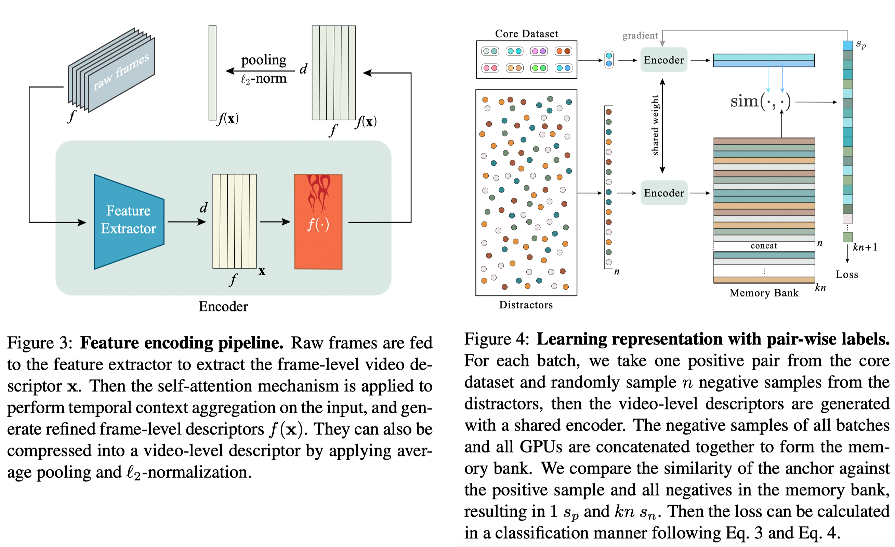

# Temporal Context Aggregation for Video Retrieval with Contrastive Learning
By [Jie Shao](mailto:shaojie@fudan.edu.cn)\*, [Xin Wen](http://wen-xin.info/)\*, [Bingchen Zhao](http://info.zhaobc.me/) and [Xiangyang Xue](https://scholar.google.com/citations?user=DTbhX6oAAAAJ&hl=en) (*: equal contribution)

This is the official PyTorch implementation of the paper "[Temporal Context Aggregation for Video Retrieval with Contrastive Learning](https://openaccess.thecvf.com/content/WACV2021/html/Shao_Temporal_Context_Aggregation_for_Video_Retrieval_With_Contrastive_Learning_WACV_2021_paper.html)".

## Introduction
In this paper, we propose TCA (Temporal Context Aggregation for Video Retrieval), a video representation learning framework that incorporates long-range temporal information between frame-level features using the self-attention mechanism.



To train it on video retrieval datasets, we propose a supervised contrastive learning method that performs automatic hard negative mining and utilizes the memory bank mechanism to increase the capacity of negative samples.

The proposed method shows a significant performance advantage (∼17% mAP on FIVR-200K) over state-of-the-art methods with video-level features, and deliver competitive results with 22x faster inference time comparing with frame-level features.

## Getting Started
### Requirements
Currently, we only tested the code compacity with the following dependencies:
* Python 3.7
* PyTorch == 1.4.0
* Torchvision == 0.5.0
* CUDA == 10.1
* Other dependencies
### Installation
* Clone this repo:
```sh
git clone https://github.com/xwen99/temporal_context_aggregation.git
cd temporal_context_aggregation
```
* Install the dependencies:
```sh
pip install -r requirements.txt
```
### Preparing the Data
* Please follow the instructions in the `pre-processing` folder.
### Training
* Example training script on the VCDB dataset on an 8-gpu machine:
```sh
CUDA_VISIBLE_DEVICES=0,1,2,3,4,5,6,7 horovodrun -np 8 -H localhost:8 \
python train.py \
--annotation_path datasets/vcdb.pickle \
--feature_path PATH/TO/YOUR/DATASET \
--model_path PATH/TO/YOUR/MODEL \
--num_clusters 256 \
--num_layers 1 \
--output_dim 1024 \
--normalize_input \
--neg_num 16 \
--epochs 40 \
--batch_sz 64 \
--learning_rate 1e-5 \
--momentum 0.9 \
--weight_decay 1e-4 \
--pca_components 1024 \
--padding_size 300 \
--num_readers 32 \
--num_workers 1 \
--moco_k 4096 \
--moco_m 0. \
--moco_t 1.0 \
--print-freq 1 \
--use-adasum \
--fp16-allreduce \
```
### Evaluation
* Example evaluation script on the FIVR-5K dataset:
```sh
python3 evaluation.py \
--dataset FIVR-5K \
--pca_components 1024 \
--num_clusters 256 \
--num_layers 1 \
--output_dim 1024 \
--padding_size 300 \
--metric cosine \
--model_path PATH/TO/YOUR/MODEL \
--feature_path PATH/TO/YOUR/DATASET \
```
## Acknowledgement
Our codebase builds upon several existing publicly available codes. Specifically, we have modified and integrated the following repos into this project:

* https://github.com/facebookresearch/moco
* https://github.com/MKLab-ITI/visil

## Citation
```
@InProceedings{Shao_2021_WACV,
    author    = {Shao, Jie and Wen, Xin and Zhao, Bingchen and Xue, Xiangyang},
    title     = {Temporal Context Aggregation for Video Retrieval With Contrastive Learning},
    booktitle = {Proceedings of the IEEE/CVF Winter Conference on Applications of Computer Vision (WACV)},
    month     = {January},
    year      = {2021},
    pages     = {3268-3278}
}
```

## License
This project is licensed under the Apache License 2.0 - see the [LICENSE](LICENSE) file for details.

## Contact
Xin Wen: im.xwen@gmail.com